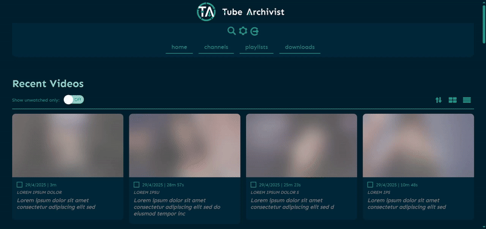
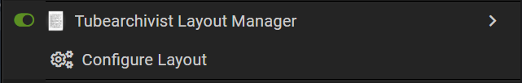
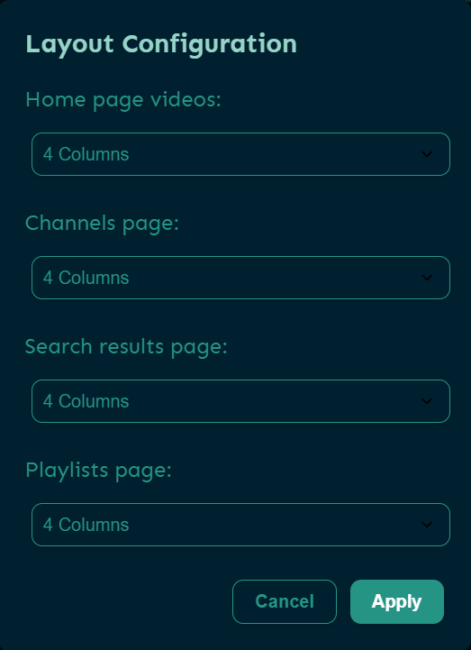
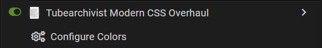
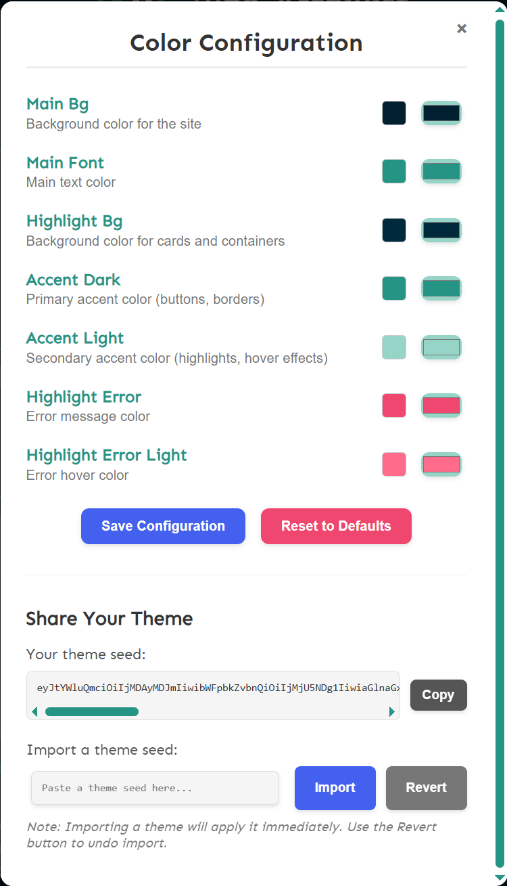

# Tubearchivist Visual Overhaul
This set of tampermonkey scripts aim to make the Tubearchivist interface more visually appealing as well as taking more screen space for the tile layout.

# Configurable options for the layout:

# Configurable options for the css. Make your own theme and share it with others!:

